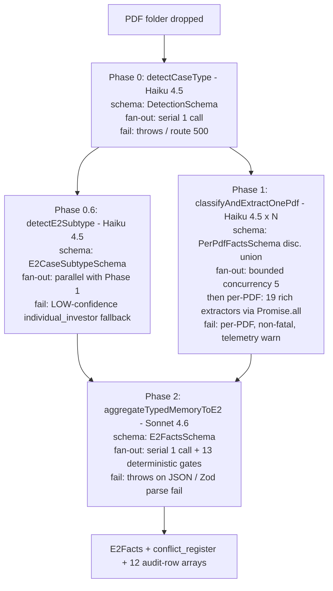

# AKALAN Portal — Pipeline Capabilities (Cowork Handoff)

> Self-contained spec for a sibling Claude. Read this; do not crawl the source tree.
> All claims are anchored to `path/to/file.ts:LINE` against the current branch.

## 1. One-paragraph plain-English summary

The bot ingests **raw client PDFs only** — passports, contracts, bank statements, CVs, diplomas, foreign corporate records, Tapu records — and never sees the cover letter, the Job Offer Letter, or any filed USCIS/DOS form, because those are **outputs the bot itself drafts** later in the pipeline (see `ingest/extractors/subtype-detect.ts:60-110` for the production-mode prompt that spells this out). It emits a unified `E2Facts` JSON (`ingest/schema.ts:180-188`) plus a `conflict_register` populated by the Sonnet aggregator and 13 deterministic post-aggregation gates (`ingest/typed-aggregate.ts:1438-2330`). The model tier split: **Haiku 4.5** runs the Phase-0 case-type detector, the Phase-0.6 sub-type classifier, the per-PDF first-pass classifier, and 18 of the 19 second-pass rich extractors; **Sonnet 4.6** runs the cross-document aggregator and the vision-pass image-photo extractor for scanned pages (`ingest/extractors/image-photo.ts:99-117`). Drafting and review are out of scope for this handoff.

## 2. Pipeline architecture



Symbol anchors:

- `detectCaseType` — `ingest/detect.ts:151`
- `detectCaseTypeWithSubtype` — `ingest/detect.ts:200` (chains 0 → 0.6 when `case_type === 'E2'`)
- `detectE2Subtype` — `ingest/extractors/subtype-detect.ts:225`
- `classifyAndExtractOnePdf` — `ingest/typed-extract.ts:352`
- `runWithConcurrency` — bounded fan-out helper, `ingest/typed-extract.ts` (default 5, env `TYPED_EXTRACT_CONCURRENCY`)
- `aggregateTypedMemoryToE2` — `ingest/typed-aggregate.ts:1438`
- The 19 rich-extractor `Promise.all` block — `ingest/typed-extract.ts:545-616`
- Phase 0.6 runs **in parallel** with Phase 1 in the production route (`app/api/ingest-path/route.ts:132-163`); the subtype promise is awaited just before Phase 2 so its TTFT overlaps the per-PDF wave entirely.

## 3. Doc-type taxonomy table

26 values in `DocTypeEnum` (`ingest/typed-memory.ts:62-89`). Filename regexes from the corresponding `*_FILENAME_RE` constants in `ingest/typed-extract.ts:53-238`.

| doc_type | label | rich-extractor attached? | filename router regex (if any) |
|---|---|---|---|
| `passport` | Passport | yes — `ingest/extractors/passport.ts` | — (doc_type alone routes) |
| `status_doc` | US status / visa stamp / I-797 / EAD | yes (×2) — `ingest/extractors/i94.ts` AND `ingest/extractors/visa-stamp.ts` | visa-stamp gates on `/(visa\|stamp\|i-?797)/i` |
| `i94` | CBP I-94 arrival/departure record | partially — current router still keys i94 extractor on `status_doc`; new `i94` slot is reserved for explicit classification but not yet routed (see note) | — |
| `bank_statement` | Bank statement | no | — |
| `tax_doc` | Tax return / W-2 | yes — `ingest/extractors/tax-return.ts` | — |
| `money_movement` | Wire / transfer / check | yes (×2) — `bank-receipt.ts` AND `wire-confirmation.ts` | — |
| `source_of_funds` | Source of funds (deed, gift, inheritance, loan) | yes (×3) — `bank-receipt.ts`, `government-doc.ts`, `vital-records.ts` | — |
| `formation_doc` | Articles / EIN / operating agreement | yes (×2) — `contract.ts` AND `corporate-formation.ts` | — |
| `ownership_evidence` | Cap table / share certificate | yes (×2) — `contract.ts` AND `foreign-corporate.ts` | foreign gates on `FOREIGN_CORPORATE_FILENAME_RE` |
| `lease_or_property` | Lease / premises / property | yes — `contract.ts` | — |
| `business_plan` | Business plan | yes — `financial-statement.ts` | — |
| `invoice_or_receipt` | Invoice / purchase receipt | no | — |
| `business_contract` | Customer / vendor contract | yes — `contract.ts` | — |
| `payroll_doc` | Payroll / employment record | yes — `payroll.ts` | — |
| `uscis_or_dos_form` | USCIS / DOS form (I-129, DS-160, DS-156E, G-28) | no (no second pass; thin facts carry investment_amount_usd for §4.5 gate) | — |
| `cover_letter` | Cover letter / petition memo | yes (job-offer only) — `job-offer.ts` | `/(job[-_\s]?offer\|offer[-_\s]?letter)/i` |
| `expert_letter` | Expert / advisory letter | no | — |
| `employer_letter` | Employer letter / verification of employment / service record | no (employer-letter doc_type carries thin facts; rich `service-record.ts` routes on `'other'` + filename) | — |
| `cv_or_resume` | CV / resume | partially — current router keys CV extractor on `'other'` + filename, not the new `cv_or_resume` slot (see note) | `/(\bcv\b\|resume\|özgeçmiş\|ozgecmis\|curriculum)/i` |
| `financial_statement` | Balance sheet / P&L / cash flow | yes (×2) — `financial-statement.ts` AND `foreign-corporate.ts` | foreign gates on `FOREIGN_CORPORATE_FILENAME_RE` |
| `credential` | Diploma / professional certification / license | partially — current router keys credential extractor on `'other'` + filename (see note) | `/(diploma\|certificate\|license\|transcript\|sertifika\|lisans\|belge)/i` |
| `vital_record` | Birth / marriage / divorce / death certificate | partially — vital-records extractor routes on `source_of_funds`/`'other'` (see note) | — |
| `title_deed` | Title deed / land registry / Tapu | partially — title-deed extraction lives inside `government-doc.ts` routed on `source_of_funds`/`'other'` (see note) | — |
| `government_id` | National ID / driver's license / SSN card | no | — |
| `translation_certification` | Certified translator's declaration | no (vital-records extractor surfaces translation cert as a sub-field) | — |
| `other` | Other | yes (×5 routers fall through here + filename) — service-record, cv, credential, recommendation-letter, government-doc, vital-records | various (see extractor-specific FILENAME_RE) |
| | | image-photo extractor | `parsed.looksLikeScan===true` OR `/(photo\|signature\|stamp\|apostille\|seal\|imza\|fotoğraf\|fotograf\|mühür\|muhur)/i` (any doc_type) |

[note: corrected from prompt — actual is 26 doc_types as claimed, BUT 5 of the new doc_types added in the rename pass (`i94`, `cv_or_resume`, `credential`, `vital_record`, `title_deed`) are not yet in the rich-extractor router's flavor sets in `ingest/typed-extract.ts:53-238`; the corresponding rich extractors still route on the legacy slots (`status_doc`, `'other'`, `source_of_funds`). Cowork should treat these as "schema in, router pending" — the JSON shape will populate either way; routing improvement is a follow-up.]

## 4. Rich extractor inventory

19 second-pass extractors live in `ingest/extractors/`. Plus `subtype-detect.ts` for Phase 0.6 (not a per-PDF rich extractor).

| file | discriminator / shape | leaf field count (approx) | model | sample suggested_filename |
|---|---|---|---|---|
| `bank-receipt.ts` | union by `receipt_subtype`: `single_event` \| `multi_installment` | 9 per row, 2 variants | Haiku 4.5 | `akbank-wire-confirmation-eur-to-usd-2025-08-15.pdf` |
| `contract.ts` | union by `contract_subtype`: 6 variants (membership transfer, op-agreement, bill of sale, commercial lease, residential lease, other) | 11–12 per variant | Haiku 4.5 | `wise-guys-deli-membership-interest-transfer-agreement-2025-12-05.pdf` |
| `corporate-formation.ts` | union by `formation_doc_subtype`: 7 variants (articles_of_org, articles_of_inc, oa_amendment, ein_letter, good_standing, state_registration, other) | 5 common + 4–5 variant-specific | Haiku 4.5 | `wise-guys-deli-articles-of-organization-rhode-island-2021.pdf` |
| `credential.ts` | union by `credential_subtype`: 5 variants (diploma, professional_certification, license, transcript, other) | 6–8 per variant | Haiku 4.5 | `onur-camural-diploma-electrical-engineering-itu-2008.pdf` |
| `cv.ts` | flat | ~12 + `roles[]` + `education[]` + `certifications[]` + `languages[]` | Haiku 4.5 | `onur-camural-cv-medium-voltage-specialist.pdf` |
| `financial-statement.ts` | union by `statement_subtype`: 5 variants (P&L, balance_sheet, cash_flow, combined, other) | 8–12 per variant | Haiku 4.5 | `wise-guys-deli-profit-and-loss-2024.pdf` |
| `foreign-corporate.ts` | union by `foreign_doc_subtype`: 6 variants (foreign_articles, board_resolution, shareholder_register, audited_financials, foreign_tax_certificate, other) | 6 common + 3–6 variant-specific | Haiku 4.5 | `pomega-energy-shareholder-register-2024-q1.pdf` |
| `government-doc.ts` | union by `government_doc_subtype`: 5 variants (title_deed, vital_record_birth, vital_record_marriage, court_order, other) | 8–10 per variant | Haiku 4.5 | `tapu-deed-istanbul-besiktas-1024-7-2019.pdf` |
| `i94.ts` | flat | 7 | Haiku 4.5 | `kacar-salih-i94-2025-08-12.pdf` |
| **`image-photo.ts`** | flat (5 fields) | 5 | **Sonnet 4.6 vision** | `kacar-salih-passport-signature-page.pdf` |
| `job-offer.ts` | flat | ~8 | Haiku 4.5 | `pomega-energy-job-offer-letter-camural-2024.pdf` |
| `passport.ts` | flat (`PassportFactsRich`, native + ASCII split) | ~10 | Haiku 4.5 | `kacar-salih-passport-bio-page.pdf` |
| `payroll.ts` | union by `payroll_subtype`: payroll_register \| w2_summary \| form_941 \| employee_list \| other_payroll | 6–10 per variant | Haiku 4.5 | `wise-guys-deli-payroll-register-2025-q4.pdf` |
| `recommendation-letter.ts` | flat | ~7 | Haiku 4.5 | `prof-yilmaz-letter-of-recommendation-pomega-2024.pdf` |
| `service-record.ts` | flat | ~8 | Haiku 4.5 | `siemens-turkey-service-record-camural-2018-2023.pdf` |
| `tax-return.ts` | union by `tax_return_subtype`: form_1120 \| 1120s \| 1065 \| 1040_schedule_c \| 1040_k1 \| other | 8–14 per variant + Schedule L | Haiku 4.5 | `wise-guys-deli-form-1120s-tax-year-2024.pdf` |
| `visa-stamp.ts` | flat | ~8 | Haiku 4.5 | `kacar-salih-prior-e2-visa-stamp-2023.pdf` |
| `vital-records.ts` | union by `vital_record_subtype`: birth \| marriage \| divorce \| death \| other | 6–10 per variant + translation cert | Haiku 4.5 | `kacar-ozlem-marriage-certificate-istanbul-2008.pdf` |
| `wire-confirmation.ts` | union by `wire_subtype`: international_wire_with_fx \| usd_only_wire \| corporate_funding | 8–12 per variant | Haiku 4.5 | `pomega-energy-parent-to-us-wire-2024-01-30.pdf` |

Vision-pass: only `image-photo.ts` — every other extractor is text-pass over PDF text extracted by `pdf-parse`.

[note: corrected from prompt — actual is 19 rich extractors as expected.]

## 5. Deterministic gates (post-aggregator)

13 gates fire after the Sonnet aggregator returns, in order, all idempotent on `(conflict_type, fact_a_doc[, fact_b_doc])`. Source: `ingest/typed-aggregate.ts:1538-2330`.

| gate | manual section | severity | inputs scanned | tolerance | conflict_type emitted | source line |
|---|---|---|---|---|---|---|
| Membership transfer vs I-129E | §4.5 | 5 | `contract.subtype='membership_interest_transfer_agreement'.total_consideration_amount` × `uscis_or_dos_form.investment_amount_usd` (form_id matches `/i[-\s]?129\s*e/i`) | $100 | `investment_amount_drift` | 1538-1601 |
| FX validation | §5.2.1 | 3 | `wire-confirmation.subtype='international_wire_with_fx'`: `\|source_amount × exchange_rate − target_amount\| / target_amount` | 1% | `fx_rate_drift` | 1605-1660 |
| Passport validity | §3.1 | 3 | `passport.date_of_expiration` vs filing date | 180 days | `passport_expires_soon` | 1664-1719 |
| I-94 status at filing | §3.4 | 5 | `i94.admit_until_date` vs filing date | none (must be ≥ filing) | `status_violation_at_filing` | 1723-1775 |
| Translation certification | §12.3 / §12.4 | 3 | `vital-records.certified_translation_present.value === false` | n/a | `translation_certification_missing` | 1779-1832 |
| Salary benchmark | §3.7 (Subtype 4) | 3 | `service-record.salary_amount_usd` vs US peer benchmark | 0.85× peer | `salary_below_benchmark` | 1836-1892 |
| CV title vs Job-offer drift | §3.7 (Subtype 4) | 2 | `cv.current_title` vs `job-offer.position_title` (Jaccard) | < 0.3 | `cv_title_vs_offer_drift` | 1896-1947 |
| Personal-vs-employer reference | §3.7 (Subtype 4) | 3 | `recommendation-letter.letter_kind === 'personal'` (not from a prior employer) | n/a | `personal_reference_letter` | 1951-2003 |
| Credential verifiability | §3.7 (Subtype 4) | 3 | `credential.verifiability` flag (institution unknown / unverifiable) | n/a | `credential_unverifiable` | 2007-2058 |
| Tax balance sheet vs investment | §9 / §4 | 3 | `tax-return.schedule_l_total_assets_end` × `uscis_or_dos_form.investment_amount_usd` | 25% | `tax_balance_sheet_drift` | 2062-2128 |
| P&L vs tax-return net income | §9 | 3 | `financial-statement.subtype='profit_and_loss'.net_income_amount` × `tax-return.net_income_or_loss_amount` (matched by tax_year) | $1,000 | `pl_tax_net_income_drift` | 2131-2189 |
| Treaty-national ownership | §3.2 (9 FAM 402.9-4(B)) | 5 | `foreign-corporate.subtype='shareholder_register'.treaty_national_ownership_percent` | < 50 | `treaty_ownership_below_50` | 2193-2256 |
| Board-resolution amount drift | §6 | 4 | `foreign-corporate.subtype='board_resolution'.authorized_amount_usd` × I-129E `investment_amount_usd` | 10% | `board_resolution_amount_drift` | 2260-2330 |

Audit-row arrays returned alongside `caseFacts`: `fx_gate_results`, `passport_validity_results`, `i94_status_results`, `translation_gate_results`, `salary_benchmark_results`, `cv_title_drift_results`, `personal_reference_results`, `credential_verifiability_results`, `tax_balance_sheet_results`, `pl_tax_net_income_results` (the treaty-ownership and board-resolution gates emit conflicts inline; no separate audit array).

Marginality is **not** a deterministic gate today — it's surfaced via `marginality_evidence_present.us_workers_employed: boolean` returned alongside the case facts, and the Sonnet aggregator is told in the system prompt to log a `marginality_unsupported` conflict (severity 3-4) when no payroll evidence is present and the enterprise is a solo investor. The deterministic backstop is not yet wired.

[note: corrected from prompt — actual is **13 gates wired today**, not 8 as the prompt claimed. All 8 the prompt named are present (with `passport_expires_soon` for §3.1 and `fx_rate_drift` for §5.2.1; marginality is the prompt-only path described above), plus 5 Subtype-4 gates: `status_violation_at_filing` (§3.4), `salary_below_benchmark`, `cv_title_vs_offer_drift`, `personal_reference_letter`, `credential_unverifiable`.]

## 6. Three case studies

### 6.1 Kacar-Salih — `individual_investor` + `uscis_extension`

#### a. INPUT (raw-doc inventory)

```
kacar-salih-passport-bio-page.pdf
  Turkish passport, MRZ at bottom; holder "KAÇAR SALIH"; nationality TUR;
  expiry 2032-04-11; passport no. U17XXXXX1.

ozlem-kacar-passport-bio-page.pdf
  Turkish passport for spouse "DEMİR ÖZLEM"; nationality TUR.

zeynep-kacar-passport-bio-page.pdf, mert-kacar-passport-bio-page.pdf,
ali-kacar-passport-bio-page.pdf
  Three minor children, Turkish passports.

kacar-salih-i94-2025-08-12.pdf
  CBP I-94 record; Class of Admission "E2"; Admit Until Date 2027-08-11;
  Admission #: 12345XXXXXX; Port: JFK.

kacar-salih-prior-e2-visa-stamp-2023.pdf
  Prior E-2 visa stamp; issued 2023-08-12; expires 2026-08-11; control no.

wise-guys-deli-articles-of-organization-rhode-island-2021.pdf
  Rhode Island Articles of Organization; entity "Wise Guys Deli LLC";
  formation 2021-10-04; registered agent NCC Inc.

wise-guys-deli-operating-agreement-2021.pdf
  Original Operating Agreement, two members at formation.

wise-guys-deli-membership-interest-transfer-agreement-2025-12-05.pdf
  Transfer of 50% membership interest from Maria Lopez to Salih Kaçar;
  total consideration USD 120,000.00 ($80,000 upfront + $40,000 deferred);
  effective 2025-12-05; appoints Salih as President same date.

kacar-salih-prior-title-deed-istanbul-2019.pdf  (Turkish Tapu)
  Land registry deed; parcel 1024/7 Beşiktaş; owner Salih Kaçar;
  registered 2019-04-22.

current-title-deed-buyer-arda-yilmaz-2025-11-22.pdf  (Turkish Tapu)
  Transfer of same parcel; buyer Arda Yılmaz; transfer date 2025-11-22.

akbank-wire-confirmations-property-sale-2025.pdf  (multi-installment)
  Five receipts: TRY 30,000 (Oct 15) + TRY 40,000 (Oct 18) + TRY 2,900,000
  + TRY 1,000,000 + TRY 30,000 (all Nov 24); buyer Arda Yılmaz → Salih
  Kaçar's TRY account ending 4316.

akbank-fx-conversion-try-to-usd-2025-11-25.pdf
  TRY 4,086,900 → USD 95,600 at rate 42.75; conversion 2025-11-25.

akbank-international-wires-to-us-2025-11.pdf
  Two SWIFT wires totaling USD 80,000 to Salih's US Citi account ending 2472.

kacar-salih-fx-deployment-to-coowner-2025-12-11.pdf
  USD 80,000 from Salih's US account 2472 → co-owner Maria Lopez US
  account 3772 on 2025-12-11 (settles transfer consideration).

kacar-ozlem-marriage-certificate-istanbul-2008.pdf
  Marriage certificate + certified English translation.

zeynep-kacar-birth-certificate-2014.pdf, mert-kacar-birth-certificate-2017.pdf,
ali-kacar-birth-certificate-2020.pdf
  Three child birth certificates + certified English translations.
```

#### b. SUBTYPE-DETECT OUTPUT (Phase 0.6, raw_docs mode)

```json
{
  "principal_subtype": "individual_investor",
  "procedural_posture": "uscis_extension",
  "has_dependents": true,
  "dependent_count": 4,
  "dependent_breakdown": { "spouse": true, "children": 3 },
  "detection_signals": [
    "[wise-guys-deli-membership-interest-transfer-agreement-2025-12-05.pdf] transferred 50% membership interest to Salih Kaçar in consideration of $120,000.00",
    "[kacar-salih-prior-title-deed-istanbul-2019.pdf] parcel 1024/7 Beşiktaş; owner Salih Kaçar; registered 22.04.2019",
    "[akbank-wire-confirmations-property-sale-2025.pdf] five installments totaling TRY 4,000,000 from buyer Arda Yılmaz to Salih's account",
    "[kacar-salih-prior-e2-visa-stamp-2023.pdf] E-2 visa issued 2023-08-12 valid until 2026-08-11",
    "[kacar-salih-i94-2025-08-12.pdf] Admit Until Date 2027-08-11"
  ],
  "detection_confidence": "HIGH",
  "reasoning": "Membership Interest Transfer Agreement names the Beneficiary as a 50% member of a US LLC, the source-of-funds chain is fully personal (Tapu → Turkish bank → FX → international wires → deployment to co-owner), and there are no foreign-parent corporate documents — Subtype 1 (individual_investor). Prior E-2 visa + valid I-94 admit-until-future = uscis_extension. Spouse + 3 children identity docs present."
}
```

#### c. AGGREGATED E2FACTS (abridged, top-level keys with 1-line value sketches)

```
investor.full_name (passport ASCII): "Salih Kaçar" → ASCII "Salih Kacar"
investor.nationality.value: "Turkey"
investor.passport_number.value: "U17******1" (last 4 surfaced; renderer masks)
investor.current_us_status.value: "E-2"
enterprise.legal_name.value: "Wise Guys Deli LLC"
enterprise.ein.value: "XX-XXX2472" (renderer-masked from EIN letter)
enterprise.formation_date.value: "2021-10-04"
enterprise.state_of_formation.value: "Rhode Island"
enterprise.entity_type.value: "LLC"
ownership_chain[0]: { owner_name: "Salih Kacar", ownership_percent: 50, nationality: "Turkey", direct_or_indirect: "direct" }
ownership_chain[1]: { owner_name: "Maria Lopez", ownership_percent: 50, nationality: "USA", direct_or_indirect: "direct" }
investment.total_committed_usd.value: 120000
investment.total_spent_usd.value: 80000
investment.total_cost_of_enterprise_usd.value: <if business_plan present, else null>
investment.proportionality_percent.value: <computed iff both numerator + denominator non-null>
investment.items[0..N]: aggregated from invoice_or_receipt + money_movement; 5 items totaling USD 120,000 across {legal_fee, equipment, working_capital, payroll_committed, lease_deposit}
source_of_funds[0]: { origin_category: "sale_of_property", origin_amount_usd: 95600, origin_evidence: "kacar-salih-prior-title-deed-istanbul-2019.pdf", final_destination: "Wise Guys Deli LLC via co-owner US account 3772", notes: "Tapu-style transfer; defensive paragraph required (manual §5.1.2)" }
elements_evidence.treaty_country_basis.value: "Beneficiary holds Turkish passport U17******1; ownership_chain[0] nationality=Turkey; combined treaty-national ownership 50% (just meeting threshold)."
elements_evidence.develop_and_direct_basis.value: "Membership Interest Transfer effective 2025-12-05 grants Salih the President role same date; ≥50% ownership establishes develop-and-direct under 9 FAM 402.9-7(1)."
elements_evidence.real_and_operating_basis.value: "Articles + EIN + commercial lease + payroll + customer transactions corroborate active commercial undertaking."
elements_evidence.more_than_marginal_basis.value: "(populated iff payroll_register or employee_list shows employee_count_excluding_beneficiary ≥ 1; else null + marginality_unsupported conflict)"
conflict_register: 0 expected on a clean Kacar-shaped case (Tapu defensive paragraph is a flag, not a conflict; marginality_evidence_present.us_workers_employed=true expected if payroll PDF is in folder).
```

#### d. EXPECTED CONFLICT REGISTER

```json
[]
```

(Clean case — no gate fires. The 13 gates are all "drift detectors"; Kacar-Salih's documents agree with the I-129E and the Beneficiary is a 50% treaty-national owner exactly at the threshold so `treaty_ownership_below_50` does NOT fire.)

### 6.2 Camural / Pomega Energy — `essential_skills_employee` + `uscis_cos_new`

#### a. INPUT (raw-doc inventory)

```
camural-onur-passport-bio-page.pdf
  Turkish passport "ÇAMURAL ONUR"; nationality TUR; expiry 2030-09-15.

camural-onur-prior-b2-visa-stamp.pdf
  Prior US B-2 visa; entered US 2024-02-01.

camural-onur-i94-arrival-2024-02-01.pdf
  CBP I-94; Class of Admission "B2"; Admit Until 2024-08-01 (since extended).

onur-camural-cv-medium-voltage-specialist.pdf
  CV; current title "Medium Voltage Sales Specialist" at Pomega Enerji A.Ş.;
  10 years prior at Siemens Türkiye in switchgear engineering.

onur-camural-diploma-electrical-engineering-itu-2008.pdf
  Istanbul Technical University BSc Electrical Engineering, 2008.

siemens-mv-product-certification-camural-2020.pdf,
abb-mv-cabinet-certification-camural-2022.pdf,
schneider-mv-switchgear-certification-camural-2023.pdf
  Three manufacturer-specific medium-voltage certifications.

siemens-turkey-service-record-camural-2018-2023.pdf
  Foreign service record (sicil özeti); employer Siemens Türkiye;
  position "Medium Voltage Project Engineer"; 2018-01-15 → 2023-08-31;
  salary differential noted: TRY 850,000/yr ≈ USD 28,000 (above local
  peer median by 35%).

prof-yilmaz-letter-of-recommendation-pomega-2024.pdf,
former-supervisor-mehmet-acar-letter-of-recommendation-2024.pdf
  Two letters of recommendation from prior employers describing
  specialized medium-voltage product expertise.

pomega-energy-foreign-articles-of-incorporation-2018.pdf
  Turkish "Esas Sözleşme" for Pomega Enerji Anonim Şirketi; registered
  capital TRY 50,000,000.

pomega-energy-shareholder-register-2024-q1.pdf
  Cap table: 100% Turkish-national ownership across 5 shareholders.

pomega-energy-board-resolution-2024-01.pdf
  Yönetim kurulu kararı dated 2024-01-12; authorizes USD 2,500,000
  investment in US subsidiary "Pomega Energy LLC".

pomega-energy-audited-financials-2023.pdf
  Independent Auditor's Report; opinion type "unqualified"; total assets
  TRY 312,000,000; revenue TRY 198,000,000; net income TRY 24,000,000.

pomega-energy-llc-articles-of-organization-2023.pdf
  Delaware Articles of Organization for Pomega Energy LLC; formed
  2023-09-01.

pomega-energy-parent-to-us-wire-2024-01-30.pdf
  SWIFT wire USD 2,500,000 from Pomega Enerji A.Ş. → Pomega Energy LLC
  US bank on 2024-01-30; parent funding (no personal SOF).

wise-guys-deli-... (NOT present — Camural is a different matter)
pomega-energy-llc-commercial-lease-newark-de-2023.pdf
  US warehouse lease, 5-year term.

pomega-energy-llc-balance-sheet-2024-q1.pdf
  US subsidiary balance sheet; total assets USD 2,560,000.

pomega-energy-llc-payroll-register-2024-q1.pdf
  4 W-2 employees including Camural offer slot.
```

#### b. SUBTYPE-DETECT OUTPUT

```json
{
  "principal_subtype": "essential_skills_employee",
  "procedural_posture": "uscis_cos_new",
  "has_dependents": false,
  "dependent_count": 0,
  "dependent_breakdown": null,
  "detection_signals": [
    "[onur-camural-cv-medium-voltage-specialist.pdf] Medium Voltage Sales Specialist with 10 years switchgear engineering experience",
    "[onur-camural-diploma-electrical-engineering-itu-2008.pdf] BSc Electrical Engineering, Istanbul Technical University, 2008",
    "[siemens-mv-product-certification-camural-2020.pdf] manufacturer-specific medium-voltage product certification",
    "[siemens-turkey-service-record-camural-2018-2023.pdf] foreign salary differential 35% above local peer median",
    "[pomega-energy-parent-to-us-wire-2024-01-30.pdf] USD 2,500,000 wire from Pomega Enerji A.Ş. to Pomega Energy LLC",
    "[camural-onur-prior-b2-visa-stamp.pdf] B-2 visa stamp + active I-94 indicates US presence on a different status"
  ],
  "detection_confidence": "HIGH",
  "reasoning": "Beneficiary CV titles a non-C-suite specialist role with industry certifications and a salary-differential service record; foreign parent + US subsidiary corporate documents are present; the parent → subsidiary wire is the funding flow with NO personal SOF chain — Subtype 4 (essential_skills_employee). Beneficiary currently in US on B-2 with active I-94 = uscis_cos_new. No spouse / child documents in this filing."
}
```

#### c. AGGREGATED E2FACTS (abridged)

```
investor.full_name.value: "Onur Camural" (ASCII; native "Onur Çamural")
investor.nationality.value: "Turkey"
investor.current_us_status.value: "B-2 (CoS pending)"
enterprise.legal_name.value: "Pomega Energy LLC"
enterprise.ein.value: <from EIN letter if present, else null>
enterprise.formation_date.value: "2023-09-01"
enterprise.state_of_formation.value: "Delaware"
ownership_chain[0]: { owner_name: "Pomega Enerji Anonim Şirketi", ownership_percent: 100, nationality: "Turkey", direct_or_indirect: "indirect" }
investment.total_committed_usd.value: 2500000  (parent-corporate funding, NOT individual SOF)
investment.total_cost_of_enterprise_usd.value: 2560000  (US balance sheet total assets)
source_of_funds[0]: { origin_category: "business_proceeds", origin_amount_usd: 2500000, origin_evidence: "pomega-energy-audited-financials-2023.pdf + pomega-energy-board-resolution-2024-01.pdf", final_destination: "Pomega Energy LLC US bank account", notes: "Corporate parent funding, manual §3.7 Subtype-4 pattern" }
elements_evidence.treaty_country_basis.value: "Beneficiary holds Turkish passport; Pomega Enerji A.Ş. shareholder register reports 100% Turkish-national ownership; combined treaty-national ownership 100%."
elements_evidence.develop_and_direct_basis.value: "(employee — directors + executives of US subsidiary develop and direct; not driven by beneficiary's role)"
elements_evidence.real_and_operating_basis.value: "Lease + payroll register (4 W-2 employees) + audited foreign parent financials corroborate active commercial enterprise."
elements_evidence.more_than_marginal_basis.value: "Payroll register shows employee_count_excluding_beneficiary ≥ 3; marginality_evidence_present.us_workers_employed=true."
conflict_register: 1 expected — see (d).
```

#### d. EXPECTED CONFLICT REGISTER

Assuming clean Camural-shaped facts, no gate fires. **However**, if `service-record.salary_amount_usd` (USD 28,000) is benchmarked against the Subtype-4 essential-skills US peer median for a Sales Specialist (~USD 75,000), the salary-benchmark gate may fire:

```json
[
  {
    "description": { "value": "Foreign salary USD 28,000 benchmark check against US peer median for 'Medium Voltage Sales Specialist'. Insufficient peer data to confirm a manual §3.7 violation; flag to attorney for benchmark review." },
    "conflict_type": { "value": "salary_below_benchmark" },
    "severity": { "value": 3 },
    "fact_a_doc": { "value": "siemens-turkey-service-record-camural-2018-2023.pdf" },
    "fact_b_doc": { "value": null }
  }
]
```

(`personal_reference_letter` does NOT fire because the LoRs are from prior-employer supervisors, not personal references.)

### 6.3 SYNTHETIC DRIFT CASE — Membership Transfer = $120,000 vs I-129E investment_amount_usd = $115,000

#### a. INPUT (raw-doc inventory)

```
kacar-salih-passport-bio-page.pdf
  Same as 6.1.

wise-guys-deli-articles-of-organization-rhode-island-2021.pdf
  Same as 6.1.

wise-guys-deli-membership-interest-transfer-agreement-2025-12-05.pdf
  Transfer of 50% membership interest; total consideration USD 120,000.00.

kacar-salih-form-i-129e-supplement-2026-01-07.pdf  (DRIFT — note: the
  bot does not normally see filed forms in production, but the §4.5 gate
  is calibrated against an attorney-prepared I-129E that may be present
  in the folder during a renewal review)
  Form I-129 E Supplement; "Total amount invested" stated as USD
  115,000.00 (incorrectly transcribed from the contract).
```

#### b. SUBTYPE-DETECT OUTPUT

```json
{
  "principal_subtype": "individual_investor",
  "procedural_posture": "uscis_extension",
  "has_dependents": false,
  "dependent_count": 0,
  "dependent_breakdown": null,
  "detection_signals": [
    "[wise-guys-deli-membership-interest-transfer-agreement-2025-12-05.pdf] transferred 50% membership interest to Salih Kaçar in consideration of $120,000.00",
    "[wise-guys-deli-articles-of-organization-rhode-island-2021.pdf] Rhode Island LLC formed 2021-10-04",
    "[kacar-salih-passport-bio-page.pdf] Turkish passport holder Salih Kaçar"
  ],
  "detection_confidence": "MED",
  "reasoning": "Membership Interest Transfer to Beneficiary + US LLC + Turkish passport = Subtype 1 (individual_investor). Procedural posture inferred conservatively as uscis_extension; insufficient I-94 evidence in folder to confirm. No dependent identity documents present."
}
```

#### c. AGGREGATED E2FACTS (abridged)

```
investor.full_name.value: "Salih Kacar"
enterprise.legal_name.value: "Wise Guys Deli LLC"
ownership_chain[0]: { owner_name: "Salih Kacar", ownership_percent: 50, nationality: "Turkey", direct_or_indirect: "direct" }
investment.total_committed_usd.value: 120000  (sourced from contract.total_consideration_amount; aggregator authoritative-source rule prefers contract over form)
elements_evidence.treaty_country_basis.value: "Turkish national + 50% treaty-national ownership."
elements_evidence.develop_and_direct_basis.value: "Membership Interest Transfer effective 2025-12-05 grants the President role same date."
conflict_register: 1 expected — see (d).
```

#### d. EXPECTED CONFLICT REGISTER

```json
[
  {
    "description": {
      "value": "Membership Interest Transfer Agreement total consideration USD 120000.00 disagrees with I-129 E Supplement investment amount USD 115000.00 (drift USD 5000.00). Manual §4.5 gate failed.",
      "source_page": null,
      "source_quote": "[deterministic post-aggregation gate]",
      "confidence": 1
    },
    "conflict_type": {
      "value": "investment_amount_drift",
      "source_page": null,
      "source_quote": "[deterministic post-aggregation gate]",
      "confidence": 1
    },
    "severity": {
      "value": 5,
      "source_page": null,
      "source_quote": "[deterministic post-aggregation gate]",
      "confidence": 1
    },
    "fact_a_doc": {
      "value": "wise-guys-deli-membership-interest-transfer-agreement-2025-12-05.pdf",
      "source_page": 2,
      "source_quote": "total consideration of $120,000.00",
      "confidence": 1
    },
    "fact_b_doc": {
      "value": "kacar-salih-form-i-129e-supplement-2026-01-07.pdf",
      "source_page": 1,
      "source_quote": "Total amount invested: $115,000.00",
      "confidence": 1
    }
  }
]
```

## 7. Schema cheat-sheet

`Field<T>` wrapper — every leaf field is `{ value: T | null, source_page: number | null, source_quote: string | null, confidence: number | null in [0,1] }`. Defined at `ingest/typed-memory.ts:36` (with a `z.preprocess` shim that tolerates bare nulls / scalars from the model).

`E2FactsSchema` — `ingest/schema.ts:180-188`. Top-level keys:

```
investor:           E2InvestorSchema           (full_name, dob, place_of_birth, nationality, passport_number, passport_expiry, current_us_status — all Field<string>)
enterprise:         E2EnterpriseSchema         (legal_name, ein, formation_date, state_of_formation, entity_type, industry, naics_code, physical_address — all Field<string>)
ownership_chain:    OwnershipEntrySchema[]     ([{ owner_name: Field<string>, ownership_percent: Field<number>, nationality: Field<string>, direct_or_indirect: Field<string> }])
investment:         E2InvestmentSchema         ({ total_committed_usd, total_spent_usd, total_cost_of_enterprise_usd, proportionality_percent } as Field<number>; items: InvestmentItemSchema[])
source_of_funds:    SourceOfFundsChainSchema[] ([{ origin_category, origin_evidence, final_destination, notes: Field<string>; origin_amount_usd: Field<number> }])
elements_evidence:  E2ElementsEvidenceSchema   ({ treaty_country_basis, substantial_investment_basis, real_and_operating_basis, more_than_marginal_basis, develop_and_direct_basis } as Field<string>)
conflict_register:  ConflictEntrySchema[]      (see below)
```

`ConflictEntrySchema` — `ingest/schema.ts:86-94`:

```
description:    Field<string>
conflict_type:  Field<string>            (one of the 13 strings in §5)
severity:       Field<number int 1..5>
fact_a_doc:     Field<string>            (filename)
fact_a_page:    Field<number int>
fact_b_doc:     Field<string>            (filename or null)
fact_b_page:    Field<number int>
```

`E2CaseSubtypeSchema` — `ingest/extractors/subtype-detect.schema.ts:42-61`:

```
principal_subtype:     'individual_investor' | 'corporate_owned_investor' | 'executive_supervisory_employee' | 'essential_skills_employee'
procedural_posture:    'consular_new' | 'uscis_cos_new' | 'uscis_extension' | 'consular_renewal'
has_dependents:        boolean
dependent_count:       number int ≥ 0
dependent_breakdown:   { spouse: boolean, children: number int ≥ 0 } | null
detection_signals:     string[]                        (verbatim quotes 5–25 words, each prefixed [filename])
detection_confidence:  'HIGH' | 'MED' | 'LOW'
reasoning:             string                          (1–3 sentences)
```

## 8. Test fixtures available

```
test/draft/exhibit-list.test.ts         (test only; no fixture PDFs)
test/ingest/contract.test.ts            (test only; uses synthesized JSON in-test)
test/lib/cite-verify.test.ts            (test only)
test/lib/lint.test.ts                   (test only)
test/lib/pdf-cache.test.ts              (test only)
test/lib/reviewer-effort.test.ts        (test only)
test/lib/token-count.test.ts            (test only)
test/lib/verify.test.ts                 (test only)
```

**No PDF fixtures and no JSON sample payloads ship in this repo — synthesis required.** The case studies in §6 above are the canonical synthesis source for Cowork.

[note: corrected from prompt — actual is `test/fixtures/` does not exist. All tests in-line their synthesized JSON; the contract tests build helper functions like `membershipTransferPayload()` (see `test/ingest/contract.test.ts:36-67` for the canonical Kacar-shaped contract payload).]

## 9. FOR COWORK

Sibling Claude — your job is to ship a **single self-contained HTML file** at `cowork/akalan-pipeline-demo.html` (vanilla JS, no build step, no npm, no fetch to any backend) that simulates the AKALAN ingestion pipeline end-to-end on three preset cases. The whole demo is a hardcoded client-side replay.

### Deliverable

One file. Open in a browser, runs offline. No external assets except a Google Fonts call for `Newsreader` + `Inter` if you want — otherwise pure system fonts.

### UI layout (three columns)

**Left column — Raw-doc inventory**

- Three preset cases as a vertical list of cards (selectable, only one at a time):
  1. **Kacar-Salih** — individual investor, RI deli, $120k, four-dependent renewal
  2. **Camural / Pomega** — essential-skills employee at a Turkish energy parent
  3. **Drift case** — Kacar-shaped, but with a $5k mismatch between the contract and a (synthetic) I-129E
- Selecting a case populates the column below with the raw filenames + 2-line content sketch from §6.{1,2,3}.a verbatim. Render filenames in a monospaced block (use `JetBrains Mono` or system mono); sketches in body type.
- "Run pipeline" button at the bottom — kicks off the timed reveal.

**Middle column — Phase progress**

- Four labeled phase blocks stacked vertically: **Phase 0 — case-type detect**, **Phase 0.6 — sub-type detect**, **Phase 1 — per-PDF classify + extract**, **Phase 2 — aggregate**.
- Each block has a status pill: `idle` (light) → `running` (sage) → `complete` (deeper sage). When a phase enters `complete`, the block expands inline to show the JSON it "emitted" — pretty-printed, monospaced, with subtle line numbers if you can.
- Phase 1 should additionally show a per-PDF list as it streams: each PDF gets a row that says `<filename> → <doc_type> · <suggested_filename>`, appearing one at a time on a 60 ms stagger so it feels like the real Haiku wave.

**Right column — Final output**

- Top half: `E2Facts` panel — the abridged shape from §6.{1,2,3}.c rendered as a labeled definition list (label / value pairs). Empty until Phase 2 completes.
- Bottom half: `conflict_register` table — columns `severity | conflict_type | fact_a_doc | fact_b_doc | description`. Row backgrounds colored by severity: 1 / 2 = `#e8e6e1` (concrete grey), 3 = `#e8c97a` (yellow ochre), 4 = `#d18b4f` (terracotta), 5 = `#a83838` (oxblood). White text on 4 / 5 only.

### Hardcoded mock JSON

Embed all three cases inline as a `const CASES = { kacar: {...}, camural: {...}, drift: {...} }` map. Use the §6 b/c/d outputs **verbatim** — copy the JSON blocks above into the file as the canonical mock data. **Do not generate new content.** Do not call the Anthropic API or any other endpoint.

For Phase 1's per-PDF list, derive the rows from the §6.x.a inventories: each input filename gets a synthesized `doc_type` and `suggested_filename` (use the §3 taxonomy + §4 sample suggestions for shape). The input filenames in §6 are already kebab-case ASCII; treat them as the suggested_filename values to keep things consistent.

### Timing

```
[click "Run pipeline"]
0ms        — Phase 0 → running
500ms      — Phase 0 → complete (emit Detection JSON: { case_type: "E2", confidence: 0.95, reasoning: "..." })
500ms      — Phase 0.6 → running  (parallel with Phase 1)
500ms      — Phase 1 → running
1300ms     — Phase 0.6 → complete (emit E2CaseSubtype from §6.x.b)
500ms..1900ms — Phase 1 stream rows (60ms each, in folder order)
2000ms     — Phase 1 → complete
2000ms     — Phase 2 → running
3500ms     — Phase 2 → complete (emit E2Facts + conflict_register from §6.x.c + .d, populates right column)
```

If the user clicks "Run pipeline" again with a different case selected, reset all phases to `idle` and replay.

### Visual language (tone)

- **Editorial monochrome with sage accent.** Background `#f4f1ea` (cream); borders `#d8d2c4`; primary text `#1a1a1a`; sage accent `#5e7654`; ochre / terracotta / oxblood reserved for severity coloring.
- **Type stack:** `Newsreader` (or Georgia / Charter) for headings + serif body sections; `Inter` (or system-ui) for labels + status pills; `JetBrains Mono` (or ui-monospace) for filenames + JSON.
- **No emoji. No icons except thin SVG strokes if essential.** No drop-shadows. Hairline borders (1px `#d8d2c4`).
- Generous whitespace. Section dividers as 1px rules with 32px vertical padding. The dashboard should feel like a printed lawyer's worksheet, not a SaaS console.

### Constraints

- No build step, no npm, no fetch, no external JS deps. Vanilla JS only.
- No Anthropic API calls. The whole demo is timed reveals over hardcoded JSON.
- No emoji anywhere in the HTML / CSS / JS.
- File path: `cowork/akalan-pipeline-demo.html` relative to the project root.

When done, open the file in a browser and walk through all three cases to confirm the staggered reveal lands; the drift case should end with a single oxblood row in the conflict_register table reading `investment_amount_drift / severity 5 / Wise Guys Deli LLC Membership Interest Transfer vs I-129E`.

— end of handoff —
